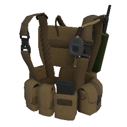
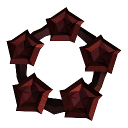
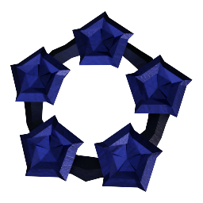
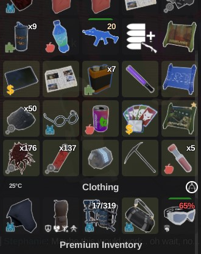
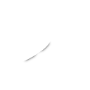
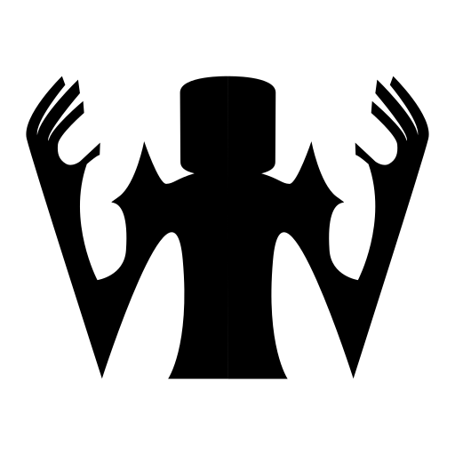

## Revived 3.0 Update (WIP)

# Welcome back to 3.0 survivor! A lot has changes since you were last here.

### Highlights
- New Items, **Dual Uzi**, **Ice Picks**, **Pouch Vest**
- New Story Mission, **Buyer's Remorse**
- New Survival **Swamplands**
- Damage mods changes

### Damage Overall!
- **Mod Tier Damage**, every gun and melee mod now provides damage based on its tier. 	
	- The tier damage amount is tied to the upgrade level of the mods.
	- Damage mods are readjusted to balance the additional damage from tier damage.

---

### Modifiers! Modifiers! Modifiers!
- All stats and mechanics calculations are now done by a new modifiers system. Used in item mods, skills, status effects, passives.

- **Modifier Breakdown** screen on workbench stats. Shows you how the item stats is being affected.
	- Modifiers also provide special mechanics such as activation input handling or game event reaction.

- **Frostbite** redesigned.
	- Every damaging shot charges Frostbite, once charged, you can press [Q] to activate it.
	- When activated, shooting enemies causes an **Ice Blast** freezing nearby enemies and applies **Frostbitten** debuff.
	- **Ice Blast**: Area of effect explosion that weak-stuns **Targets** within the **Radius** and apply **Frostbitten** to each enemy. *(Weak-stun only stuns basic enemies.)*
	- **Frostbitten**: Does **Premod Damage** as frost damage once per second and when enemies dropped below 10% of max health will instantly shatter and die.

- **Electrocute** changes, renamed from **Electric Charge**.
	- Now has a 3s cooldown shown on the weapon modifier state hud.
	- Damage now uses Premod Damage.

- Most clothing with passives now has a base modifier for their passives. 

---

### New Items

- New Tier 5 Submachine gun, **Dual Uzi**. With a built-in **Propeller Stock** that propels you forward.

- New Tier 4 Edged Melee, **Ice Picks**.

- Added new shoes, **Greaves and Sabatons**. Passive: **Chivalrous Kick**, Sliding into enemies knocks the away.

- Added new chest clothing, **Pouch Vest**. Passive: **Bullet Recouper**, Hitscan shots that missed have a 50% chance to be recouped.

- New HMG modifier, **Point-Guard Bulwark**. 
    - Additional Armor Points build up while in focus at the reduction of your Focus Movespeed.

- New Chest modifier, **Damage Divider**. 
	- When armor > 0, the damage you take is divided to health and armor damage with an additional damage reduction.

- New Melee modifier, **Melee Health Reaper**.
	- Killing 3 enemies within a time window heals you.
	

- New **Offerings** item, **Crimson**, **Azure** and **Sage** offerings are thew new way to obtain unlockables. Most item unlockables are removed from the Gold Shop and Icarus. 

---
### Gameplay News & Changes

- New **Emote Wheel**, now used for social gameplay. Emoting, sound quips, spray tags, emoji bubbles. Default Key is **C**.

- Equiped storaged such as **Duffle Bag now opens with your inventory**.
- Hitscan bullets can now pierce destructibles, causing collateral damage, meaning shooting dense part of a destructible will cause it to take multiple instance of damage.
- New **melee sounds** for slice, punture and impact.
- Added Aim Assistance for mobile/controller players.
- New melee **Lunge** mechanic on **Mega Switch Blade** & **Broomspear**. Lunge forward in any direction when attacking.
- New Blunt melee stat, **Damage Block**. Blocks a flat damage when equipping a blunt melee weapon.
    - Spiked Bat: 10, Sledgehammer: 5, Shovel: 5, NaughtyCane: 25
	- Combines with **Damage Block** from **Tire Armor**.
- Overworld Zombies are now scaled to your focus level and area difficulty.
- New **Squad Hud**, now shows on the top right of your screen.
    - Squad and teammates now also appear on your map.

- New Authority skill, **Seeing Red**. Killing enemies enhances your vision in the dark for a duration.
- **Crouching now reduces player visibility** to Bandits and Rats Npcs.
- **Food healing now stacks** and status now show heal rate.
- **Item drops** are refreshed to use a physical model and can be moved around.
- New weapon stat **Fire Alert Range**. Weapon shots can now alert enemies.
- Melee attacks now also alert close by enemies.
- Throwables will now land where your crosshair aims at.
- Improved 3rd Person camera aim.
- Improved dialogue clarity by seperating dialogues from other missions into their own sub category.
- Character stats now show up when you mouse over Clothing label in your inventory.
- Clicking the button near Armor Label now opens character stats.

---
### The Story Continues
- New core mission, **Buyer's Remorse**, from **Joseph**.
	- Frustrated with the missing deliveries from the Rats, Joseph has decided to take matters into his own hands.

---
### Survival
- Survival **Wave Pass**. Overhauled survival rewards.
    - You are given 3 or more reward options every 5 waves.
    - You can pick your next reward and continue or end the run to claim your rewards.
    - Continuing the run will risk your reward pool of the last 15 waves.
    - Every 15 waves you get to claim your rewards during the run without ending it.
    - For Hard Mode, reward option prompts only if the wave has a designated reward.

- New Survival Map, **Swamplands**. A swampy lake cabin with omnious remnants of the gathering place for a suspicious group.
	- Added new debuff, **RedCrowToxin**. When you fall into the inner swamps.

---
### NPC Changes!
- NPCs now have voices generated by **TextToSpeech** for their dialogue bubbles. **Can be turned off in audio settings.**

- New **Bandit & Rat** behavior tree. They now have more actions such as **investigating**, **hunting**, **fleeing**, **healing**. They will also communicate with each other after random stuff, alert each other if there're hostiles and if they see a dead body.
- Npcs now have a **limited angle of vision**, sneaking behind them is now a feature.
- New **Corrosive** model and abilities. Now has the ability to charge.
- New **Zpider** model.

- New **Shadow** model and abilities. Now has the ability, **ShadowStrangle**, which lifts you up. It also now spawns illusions of itself while invisible in the vicinity.
- New **Safehouse Survivors Idle bebaviors**, they now roam around and do stuff. e.g. Interact with the vending machine. 
- **The Billies** updated.
    - **Karl** now places explosive barrels around. (what does it even do?)
    - **Kylde** now uses a grenade launcher.
- Reworked **Zomborg** abilities and updated character model.
	- Now has the ability to charge an exploding beam.
- Some Npcs such as **Greg** now has a routine system that they follow based on the in-game time of day.
- **Bandit Helicopter** now taunts at you through a megaphone.
- **Vex Spitters** from Elder Vexeron are now a separate.
	- They now spawn inside the Sunken Ship.

---
### Map Updates
- New areas in **The Residential** & **The Harbor**.
    - **Water Treatment** in the North side of Residentials.
    - **RAT's Lounge** under the Harbor Safehouse.
- **Railways Raid** reworked, you now have unique objectives in each checkpoint.
	- Train is now destructible and attracts Zombies.

---
### Misc and balancing
- Mastery window now shows all weapons even at level 0.
- Boss health bars are now visible to lobby spectators.
- Inventory shift+clicking an item that was recently shift moved now moves it back to its previous slot.
- Rewritten all Npcs behavior tree to new behavior tree system.
- Improved hot key clarity.
- New TaskHud now replacing old mission hud.
- Desert Eagle now has 2 Piercing from 0.
- Expanded ZScript API for map interactable scripting.
- Terminal ZSCode now has luau script liniting.
- Adjusted skill grid order in skill tree window.
- Sunken Ship and Abandoned Bunker objectives now uses the regional missions system.
