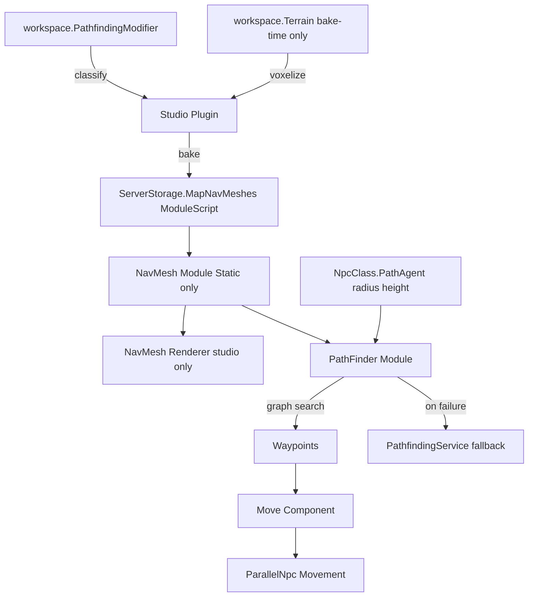

---
tags:
  - concept
  - system
---
Roblox's built-in `PathfindingService` is the bottleneck on maps with many entities. According to the microprofiler, there are also unusual interactions with `Terrain` and Mesh colliders that inflate compute time. 

Goals:
- Bake a **static navmesh** for the static map so runtime compute is a graph search, not a physics sweep.
- **Reuse computed paths** of nearby origins to nearby destinations (the existing cache already does this at a 16-stud snap; we extend it to the navmesh graph).
- **Compute in parallel / async** and keep Roblox's `PathfindingService` only as a fallback.
  
This system needs:
- [ ] A plugin to preview, adjust and bake navmeshes.
- [ ] An API that matches Roblox's `PathfindingService` API so it is a drop-in replacement.

## Assumptions

- Baked static navmesh is persisted as a **`ModuleScript` asset inside `game.ServerStorage.MapNavMeshes`** (one module per named layer). **The mere presence of this folder is the feature flag** that enables the new system; if it is absent, the engine transparently uses Roblox's `PathfindingService`.
- 
- **The `Dynamic` runtime layer is a future feature.** This plan scopes only the `Static` baked layer; runtime door/barricade edits are out of scope for now.

- **Terrain is sampled only at bake time** by the studio plugin (voxelizing `workspace.Terrain`), never at runtime. This addresses the microprofiler's "unusual Terrain interactions" without per-frame terrain queries.

- Generation must take **all `PathfindingModifier` instances under `workspace`** into account (their `PassThrough`, `Material`, and `Label` map onto navmesh surface tags and `Costs`).

- Navmesh rendering uses a **`Color3` value table** to map each surface tag to an overlay color (not hardcoded colors). The renderer is **studio-only** (debug/authoring), not replicated to clients.

- **Agent `AgentRadius` / `AgentHeight` are applied at the path-computation stage.** Any clearance data the navmesh needs to gate walkability is **baked in** during generation (see `Clearance` field), so compute only filters, never re-derives geometry.

- The custom engine wraps (not deletes) Roblox's `PathfindingService` as the existing fallback.

- The existing `NpcClass.PathAgent` config remains the single source of agent parameters; the new engine reads from it.

## Architecture




## Modules

### Nav Mesh
- Handles navmesh generation, modifications, and outputs a data structure for path computation.
- **Scope: `Static` layer only** (baked once from the base map, stored as a `ModuleScript` inside `game.ServerStorage.MapNavMeshes`, one module per named layer). The `Dynamic` runtime layer (doors, barricades, movable objects) is a **future feature** and explicitly out of scope here.
- On load, if `game.ServerStorage.MapNavMeshes` is absent, the module reports `Available = false` and all callers fall back to Roblox's `PathfindingService`. The folder's presence is the sole enable flag.


### Nav Mesh Renderer

Encapsulated renderer for the Nav Mesh with an editable toggle.
- Navmesh polygons are drawn from vertices as `CFrames` pointing inward so each face is a filled polygon.
- A thin `BasePart` (size `(x, 0, z)`) connects one vertex to another for **clickability** (selection / drag in the plugin).
- A `Highlight` instance inside a `Model` made up of those parts provides the colored overlay. Surface tags map to colors via a **`Color3` value table** (configurable, not hardcoded), e.g. `TagColors = { ground = Color3.fromRGB(0,200,0); wall = Color3.fromRGB(200,0,0); climb = Color3.fromRGB(255,150,0); roof = Color3.fromRGB(0,120,255); jump = Color3.fromRGB(255,220,0) }`.
- The renderer is **studio-only** (used by the plugin and a Studio debug HUD); it is never replicated to clients. It exposes `Show(layer)`, `Hide(layer)`, `SetEditable(bool)`, and `SetTagColors(table)`.


### Plugin
Studio plugin for static navmesh viewing, adjusting and baking.

- **Generate button**
  - Requires a region `BasePart` defining the bounds to generate within.
  - Requires a folder containing the **raw map geometry** to sample. Nothing in this folder is tagged; walkability is derived purely from the geometry: a part contributes walkable surface only when `Part.CanCollide == true` (collidable geometry defines the walkable world). Surfaces are classified by their **surface normal / angle** — `ground` for up-facing walkable, `wall` for steep, `roof` for downward-facing ceilings — and `climb` is assigned to instances whose `ClassName == "Truss"`. **Material is not used for classification.** Non-collidable parts are ignored for walkable-surface generation.
  - Scans **all `PathfindingModifier` instances under `workspace`** and folds their `PassThrough` / `Material` / `Label` into the surface classification and `Costs` (e.g. a `PathfindingModifier` with `Label = "Barricade"` raises cost to match `Barricade = 100`.
  - Voxelizes **`workspace.Terrain`** at bake time (studio only) so terrain walkable surfaces are included in the static mesh; this is the only place terrain is read, avoiding the per-frame Terrain cost seen in the microprofiler.
  - Regenerates a navmesh into a folder named after the layer.
- **Nav mesh preview** — uses the Nav Mesh Renderer module.
- **Toggle navmesh** — when a layer folder is selected, toggles that layer's visibility.
- **Vertex / edge editing** — click a rendered part to select a vertex or edge; drag to move, or retag an edge (`ground`/`wall`/`climb`/`roof`/`jump`).
- **Off-mesh links** — author `jump` links between two vertices, storing gap distance and direction; used for ledges, vaults, and `PathfindingLink` equivalents.
- **Bake / Export** — serializes the layer into a `ModuleScript` asset saved under `game.ServerStorage.MapNavMeshes` (one module per named layer). Supports multiple named layers.
- **Import** — loads an existing baked `ModuleScript` from `ServerStorage.MapNavMeshes` back into the editor for adjustment.

### Path Finder
Computes a path over the navmesh data structure. This is the runtime replacement for `PathfindingService`.
  
- **Graph build**: navmesh polygons become nodes; shared edges become connections. Off-mesh `jump`/`climb` links become zero-geometry edges with a cost derived from gap distance and the agent's `AgentCanJump`/`AgentCanClimb`.
- **Search**: A* (or Dijkstra for uniform cost) over the polygon graph, weighted by the agent `Costs` table so `DefinePath`/`Walkway`/`Slowpath`/`Barricade` behave like today's `PathAgent.Costs`.
- **Agent filtering (radius/height at compute time)**: reads `NpcClass.PathAgent` ([`src/ReplicatedStorage/Entity/NpcClass.luau:125`](src/ReplicatedStorage/Entity/NpcClass.luau:125)) — `AgentRadius`, `AgentHeight`, `AgentCanJump`, `AgentCanClimb`, `WaypointSpacing`. `AgentRadius`/`AgentHeight` are applied **during search** using the **baked `Clearance`** field on each polygon/vertex (computed at generation, not re-derived at runtime) to prune polygons the agent cannot fit through and to offset the smoothed path off walls.
- **Smoothing**: string-pull / line-of-sight funnel algorithm to collapse collinear waypoints, matching Roblox's `WaypointSpacing = math.huge` behavior already used in [`src/ReplicatedStorage/Entity/NpcClass.luau:132`](src/ReplicatedStorage/Entity/NpcClass.luau:132).
- **Off-mesh traversal**: emits a `PathWaypoint` with `Action = Jump`/`Climb` and the stored direction so the existing `customWaypoint` handler at [`src/ServerScriptService/ServerLibrary/NpcComponents/Move.lua:463`](src/ServerScriptService/ServerLibrary/NpcComponents/Move.lua:463) can react.
- **Async / parallel**: compute is invoked from the actor (`ParallelNpc`) so it never blocks the server thread; results are returned via the existing `ActorEvent` channel.
- **Missing-layer guard**: if `game.ServerStorage.MapNavMeshes` does not exist (map never baked), `PathFinder:CreatePath` immediately returns a thin wrapper that delegates `ComputeAsync` to `PathfindingService` so behavior is unchanged from today.
- **Fallback**: on `NoPath` after N retries, defer to `PathfindingService:FindPathAsync()` and store the result in the existing `SharedTable` path cache (no `Dynamic` layer write, since that is a future feature).
- **Caching**: reuse the existing `SharedTable` cache (`GlobalPathCache`, `GlobalWaypointCache`) keyed by snapped origin/dest, extended to look up sub-paths within the navmesh graph.

## Data Structures

### NavMeshLayer (ModuleScript / SharedTable)

```lua
{
    Name = "Static";
    Version = 1;
    CellSize = 1;            -- snap precision, see Optimization below
    Vertices = { Vector3, ... };
    Polygons = {
        {
            Id = 1;
            Vertices = { 0, 1, 2, 3 };   -- indices into Vertices
            Tag = "ground";              -- ground | wall | climb | roof
            Neighbors = { 2, 5, 9 };     -- adjacent polygon ids
            Center = Vector3;
            Clearance = number;          -- baked max AgentRadius that fits this polygon (studs); used at compute time
        };
    };

    Links = {                -- off-mesh connections
        {
            From = 0; To = 12;
            Type = "jump";    -- jump | climb
            Direction = Vector3;
            Gap = number;
        };
    };
}

```

### Path (returned by PathFinder:ComputeAsync)
Mirrors Roblox's `Path` object so callers are unchanged:

- `Status: Enum.PathStatus`
- `GetWaypoints(): { { Position: Vector3, Action: number, Label: string } }`
- `GetPathWaypoints()` alias for compatibility.


## API (drop-in replacement)

```lua

local modPathFinder = shared.require(game.ReplicatedStorage.Library.PathFinder);

-- matches PathfindingService:CreatePath(agentParams)
local path = PathFinder:CreatePath(npcClass.PathAgent);

-- matches Path:ComputeAsync(start, goal)
path:ComputeAsync(originPos, destPos);

if path.Status == Enum.PathStatus.Success then
    for _, wp in path:GetWaypoints() do
        -- wp.Position, wp.Action, wp.Label
    end
end

```

Integration points (minimal edits):
- [`src/ServerScriptService/ServerLibrary/NpcComponents/Move.lua:512`](src/ServerScriptService/ServerLibrary/NpcComponents/Move.lua:512) `Move:ComputePath` → call `PathFinder` instead of `PathfindingService`.
- [`src/ServerScriptService/ServerLibrary/Entity/ParallelNpc/Movement.lua:300`](src/ServerScriptService/ServerLibrary/Entity/ParallelNpc/Movement.lua:300) `computePath` → call `PathFinder`, keep cache + fallback.
- [`src/ServerScriptService/ServerLibrary/NpcComponents/Follow.lua:137`](src/ServerScriptService/ServerLibrary/NpcComponents/Follow.lua:137) and [`src/ServerScriptService/ServerLibrary/NpcComponents/Movement/init.lua:191`](src/ServerScriptService/ServerLibrary/NpcComponents/Movement/init.lua:191) `PathfindingService:CreatePath` → `PathFinder:CreatePath`.


## Optimization
- Navmesh precision is snapped to a **1-stud grid** for vertices (the runtime cache already snaps to 16; the baked mesh is finer and the cache keys off it).
- Store polygons in a flat array + adjacency list to keep A* allocation low inside the actor.
- Pre-bake `Center` and `Neighbors` so runtime search is O(edges), not O(surface scans).
- Reuse the existing `SharedTable` path cache to skip recompute for nearby origin/dest pairs.

## Todo

- [ ] **Define navmesh data schema** — create `src/ReplicatedStorage/Library/PathFinder/NavMeshData.luau` with the `NavMeshLayer`/`Polygon`/`Link` types and (de)serialization to/from the `ModuleScript` asset.
- [ ] **Implement Nav Mesh generation** — `NavMeshGenerator.luau`: voxelize a region `BasePart`, sample walkable surfaces from the raw (untagged) map-geometry folder (only `Part.CanCollide == true`), voxelize `workspace.Terrain` (bake-time only), classify by surface normal/angle (`ground`/`wall`/`roof`) and mark `climb` for `ClassName == "Truss"` (material unused), fold in every `PathfindingModifier` under `workspace` (`PassThrough`/`Material`/`Label` → tag + `Costs`), bake a per-polygon `Clearance` (max `AgentRadius` that fits), and emit vertices/polygons/neighbors snapped to 1 stud.
- [ ] **Implement Nav Mesh module** — `NavMesh.luau`: load the `Static` layer from `ServerStorage.MapNavMeshes` (no `Dynamic` layer yet — future feature), query polygon at position. If the folder is missing, set `Available = false` and let callers use Roblox's `PathfindingService`. The folder's presence is the enable flag.
- [ ] **Implement Nav Mesh Renderer** — `NavMeshRenderer.luau` (studio-only): build `Highlight`+thin-part `Model` per layer, `Show`/`Hide`/`SetEditable`/`SetTagColors`, color via the `Color3` value table.
- [ ] **Implement Path Finder** — `init.lua` (rojo entry module under `ReplicatedStorage/Library/PathFinder`): `CreatePath(agentParams)`, `ComputeAsync`, A* over polygon graph with `Costs` weighting, apply `AgentRadius`/`AgentHeight` at compute time using the baked `Clearance` field (offset smoothed path off walls), funnel smoothing, off-mesh link emission, async via actor, fallback to `PathfindingService` (cached via `SharedTable`), and the missing-`ServerStorage.MapNavMeshes` guard so an unbaked map transparently uses Roblox's `PathfindingService`.
- [ ] **Build Studio Plugin** — `src/Plugin/.../NavMeshBaker.plugin.lua`: Generate button (incl. `PathfindingModifier` scan), preview, toggle, vertex/edge editing, off-mesh link authoring, bake/export + import to `ServerStorage.MapNavMeshes`.
- [ ] **Wire integration points** — swap `PathfindingService` calls in `Move.lua`, `ParallelNpc/Movement.lua`, `Follow.lua`, `Movement/init.lua` to `PathFinder`, preserving cache + fallback.
- [ ] **Add debug HUD** — reuse `Debugger:HudPrint` / `Debugger:Ray` to visualize the active layer and computed waypoints in Studio.
- [ ] **Write tests** — bake a small test region, assert `PathFinder:ComputeAsync` returns `Success` where Roblox does, and `NoPath`+fallback where Roblox fails.