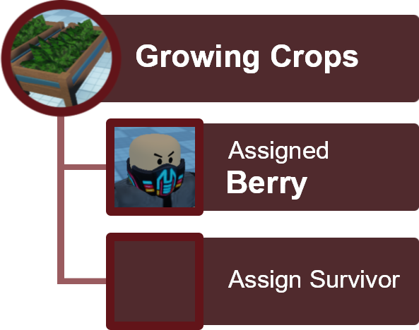

---
tags:
  - concept
  - game_mechanics
---
A 2.0 update to the safehome system for a more indepth micro management minigame for a new type of (human-)resource management element.

## Overview

Mechanics Keywords:
- Farming
- Security
- Defence
- Decorate
- Research
- Survivor Jobs
	- Farmer
	- Security
	- Guard
	- Maintainer
	- Chief

### Survivor Jobs
Each survivor has a priortised set of skills, assigning them to the roles they are good at lets them complete task more efficiently. However, they can only be assigned to two unique roles.

E.g.
(Berry) can have two jobs. Farmer & Maintainer, designated to planter and farming tool repairs.

### Hourly Log
A log that has a random event occuring in the safehome every (irl) hour. From minor issues arised from the survivors or major breaches by enemies. These log alert what players should work on upgrading, defence, food shortage, npc conflicts etc.

E.g.

- 01:00 Jackson clogs the toilet.
	- A maintainer would repair it.
- 02:00 Zoey saw a drifter staring at her at the south fence. 
	- Increase security (Install security cameras, sensors)
	- Have a Guard to shoo them away
- 03:00 Berry's farming sickle broke.
	- A maintainer would repair it.
- 04:00 Lydia and Zoey argued about who should get the last canned beans.
	- A chief will help with the dispute.
- ...

The hourly log suggests what the safehome needs and gives players something to focus on

### Source Farms
This is a general term for game mechanics that generate stuff. A resource generator for basic ingredients, these basic resource are mostly for NPC use to create other items.

- Planters for growable crops.
- Rain catchers for water gathering.
- Solar Panels for electricity.

*Dev Notes*
Gameplay depth, add custom animated prompts like the ones from the game ~~Schedule One~~ 
- [ ] Proxy tools and ingrediants laying around in the farming room.
	- This means you don't need to leave the safehome to acquire items for farming.
- [ ] Proxy tools and ingrediants are also used by Npcs if a survivor was assigned the role of **Farmer**.

You could assign a survivor on the farms or you could manage it yourself. Managing it yourself should give bonus rewards.
- Assign survivor to keep planting and watering planters.
- Assign survivor to clean the rain catcher.
- Assign survivor to replace the battery that the solar panels were charging.

### Security
Occationally, zombies or drifters may breach the safehome. They may destroy or steal resources from your safehome without anyone knowing. Thus you'll need survivors monitoring the security.
- You'll first need to install sensors and security cameras in your safehome.
- Then a survivor with the security job will respond to security alerts and get the guards to investigate or resolve security issues.

## Forward Operations
Maintaining the above mechanics provides happiness towards your safehome survivors, in return you unlock a few features that help with your outside expeditions.

### Overall Happiness
A percentage that is affected by all your safehome survivors and is made up of:
- Food
	- Most significant factor towards your overall safehome happiness, can easily be maintained.
- Safety
	- Having protection from the outside world so they can sleep soundly at night.
	- Player checking up on them increases their morale.
- Purpose
	- Survivors should have something to do by being assigned jobs.

### Acquirement Research
When overall happiness meets a threshold, you unlock the ability to research item. This feature lets you choose what your want when you receive a drop.

E.g.
You want to acquire a `healthreaper` mod from the `dmangrovecrate`, you can research the item. Once researched, you will be given a board mission:
- Mission: Researched Acquirement
	- Complete 15 waves of `Swamplands`.
Once the mission is complete, you are guaranteed a `healthreaper` drop in the reward crate.

This makes the safehome gameplay an optional but beneficial feature to players who enjoy the micromanagement gameplay elements.

### Projects
With overall happiness meeting another threshold, you can assign survivors to projects.

These are custom constructions projects that survivors will work on while you are away that might add features to improve happiness maintainance or item farms.

Additionally unlocks more customizations for the safehome and headquarters.

More TBD
