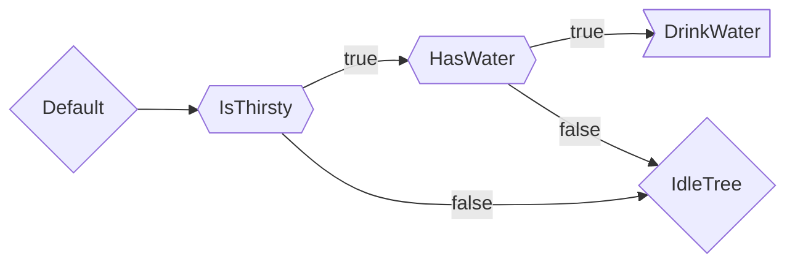
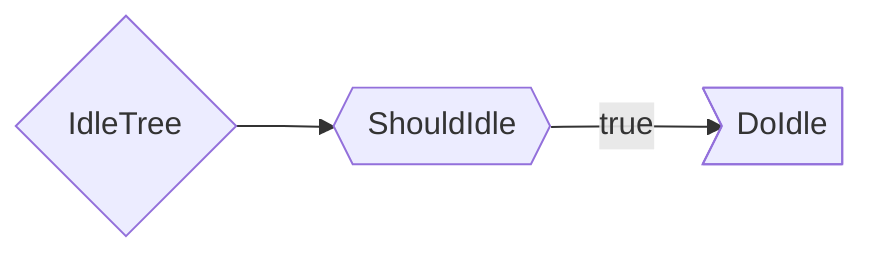
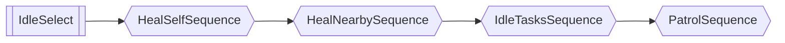
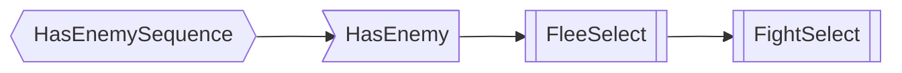

---
tags:
  - source
  - mechanics
---
# Behavior Trees
Behavior trees determines how a entity make decisions. The current system uses what I call a **LogicString**. 

**LogicString** is a string that creates a chain of boolean logic. Using `&` for AND logic, `|` for OR logic and `!` for a NOT logic. Words in a LogicString are a function name which should return either `true`, `false` or `nil`. A word with the `[word]` brackets are **[Action]** functions, these stop the chain from proceeding regardless of return value. Since it's like boolean logic, curly brackets `()` will reorder the logic sequence. 

### Example:

```lua
Default = "IsThirsty & HasWater & [DrinkWater] | IdleTree";
IdleTree = "ShouldIdle & [DoIdle]"
```
In this LogicString, it proceeds with the logic from left to right. First look for function called `IsThirsty` and if function returns `true`, the flow continues to `HasWater`, otherwise, it jumps to the OR (`|`) logic which continues with `IdleTree`.

If the tree hits `[DrinkWater]` which is consider an **[Action]**, it ends the flow regardless of what the function returns, hence it will not reach `IdleTree`.

When `ShouldIdle` return false, it will just end the flow and perform no action.

The flow chart would look more like this below.


More information on the Behavior Tree redesign: [[Behavior Tree Design]]

# Old Behavior Trees 2.2
Behavior trees are logic trees that determine how a entity make decisions.

### Tree Nodes

The 3 basic nodes are:
- Leaf Node
- Sequence Node
- Select Node

#### Leaf Node
This is an action, it contains a function that do or check something. It returns a `Success` or `Failure`, aka `true` or `false`.

E.g. 
`HasEnemy` node: If `EnemyClass` property exist, returns `Success` else `Failure`.

```luau 
function treePackage.HasEnemy(logic, npcClass: NpcClass)
    local targetHandler: NpcTargetHandler = npcClass:GetComponent("TargetHandler");
    return targetHandler.EnemyClass ~= nil and logic.Success or logic.Failure;
end
```

`FireGun` node: Point gun at target and fire primary.

#### Sequence Node
This is a logic node, it is usually a parent of a bunch of nodes which creates a logic flow chart.

Think of the **Sequence Node** as a "Until false/failure" flow.

For example:
`HealSequence` node is a sequence node that sequentially process its child nodes until it fails. The `IsLowHealth`, `HasHealItem` and `UseHealItem` are leaf nodes.

```luau
HealSequence = {"And"; "IsLowHealth"; "HasHealItem"; "UseHealItem"};
```


If a leaf node fails, the sequence stops, otherwise, it continues to the next leaf node.

#### Select Node
This is a logic node, it is usually a parent of a bunch of nodes, think of the **Select Node** as a "Until true/success" flow.

For example:
`IdleSelect` node is a select node that process its child nodes until it returns true. Usually combined with `SequenceNode` to make a comprehensive logic flow.
The `HealSelfSequence`, `HealNearbySequence`, `IdleTasksSequence`, `PatrolSequence` nodes are sequence nodes.

```luau
IdleSelect={"Or"; "HealSelfSequence"; "HealNearbySequence"; "IdleTasksSequence"; "PatrolSequence";};
```



Here it goes one by one from `HealSelfSequence` and process it to see if it succeeds, if not it continues to `HealNearbySequence`, `IdleTasksSequence` and then `PatrolSequence`

---
### Bandit's HasEnemySequence
A useful example. This sequence node handles what happens when a Bandit has an enemy assigned.

```luau
HasEnemySequence={"And"; "HasEnemy"; "FleeSelect"; "FightSelect";};
```



Which process as a sequence node (Until false):
1. `HasEnemy`: If success (true) proceeds to `FleeSelect`, otherwise sequence stops.
2. `FleeSelect`: Does the `FleeSelect` behavior tree until success true, otherwise proceeds to `FightSelect`.
3. `FightSelect`: Does the `FightSelect` behavior tree.

![[BanditDefaultTree.luau]]