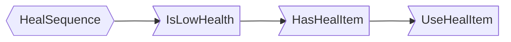
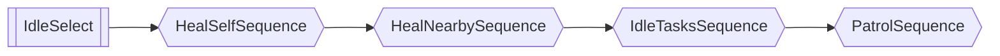

---
tags:
  - source
  - mechanics
---
Behavior trees are logic trees that determine how a entity make decisions.

### Tree Nodes

The 3 basic nodes are:
- Leaf Node
- Sequence Node
- Select Node

#### Leaf Node
This is an action, it contains a function that do or check something. It returns a `Success` or `Failure`, aka `true` or `false`.

E.g. 
`HasEnemy` node: If `EnemyClass` property exist, returns `Success` else `Failure`.

```luau 
function treePackage.HasEnemy(logic, npcClass: NpcClass)
    local targetHandler: NpcTargetHandler = npcClass:GetComponent("TargetHandler");
    return targetHandler.EnemyClass ~= nil and logic.Success or logic.Failure;
end
```

`FireGun` node: Point gun at target and fire primary.

#### Sequence Node
This is a logic node, it is usually a parent of a bunch of nodes which creates a logic flow chart.

Think of the **Sequence Node** as a "Until false/failure" flow.

For example:
`HealSequence` node is a sequence node that sequentially process its child nodes until it fails. The `IsLowHealth`, `HasHealItem` and `UseHealItem` are leaf nodes.

```luau
HealSequence = {"And"; "IsLowHealth"; "HasHealItem"; "UseHealItem"};
```



If a leaf node fails, the sequence stops, otherwise, it continues to the next leaf node.

#### Select Node
This is a logic node, it is usually a parent of a bunch of nodes, think of the **Select Node** as a "Until true/success" flow.

For example:
`IdleSelect` node is a select node that process its child nodes until it returns true. Usually combined with `SequenceNode` to make a comprehensive logic flow.
The `HealSelfSequence`, `HealNearbySequence`, `IdleTasksSequence`, `PatrolSequence` nodes are sequence nodes.

```luau
IdleSelect={"Or"; "HealSelfSequence"; "HealNearbySequence"; "IdleTasksSequence"; "PatrolSequence";};
```



Here it goes one by one from `HealSelfSequence` and process it to see if it succeeds, if not it continues to `HealNearbySequence`, `IdleTasksSequence` and then `PatrolSequence`


![[BanditDefaultTree.luau]]